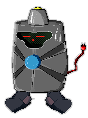

# Computer Forensics Lab
   
In this lab you will solve three of the computer forensics problems from the Toaster Wars high school hacking competition (sometimes called a “capture the flag” competition or *CTF* for short).
The premise of the competition is that a robot from space has crash landed in your backyard. It's up to you and your hacking skills to uncover the secrets he carries. For all three of these problems you will use a hex editor like HxD to examine computer files looking for clues. When you think you’ve found the answer show it to your instructor to check it.

Problem #1: XMLOL
-----------------
You've discovered a manual for the robot that has instructions on how to dump the corrupted configuration file from the robot's memory. Right click on the corrupted [XML file](tmpVrg2Ah.xml) and choose *Save link as* to save the file to your computer. Then use a hex editor like HxD to open and read the corrupted file. You are looking for a configuration key. When you think you've found it, show it to your instructor.

Problem #2: NAVSAT
------------------
You are tracking a rogue space pilot trying to determine his location. Near the Sun, you find a malfunctioning warp beacon which is broadcasting a distress signal in a navigational channel. It looks like it's been damaged by solar radiation, and [some of its data](recovery.zip) have been corrupted. If you can recover it, perhaps it will point at you to something interesting. Right click on the link, save the file to your computer and then use a hex editor like HxD to open and read the file. Find the pilot’s location. When you think you've found it, show it to your instructor.

Problem #3: Pilot Logic
-----------------------
You've gotten a [partial dump of a disk image](pilot_image), and you're pretty sure that a password belonging to the rogue space pilot is cleverly hidden somewhere within it. Use HxD to open and read the disk image and discover the password. You may find searching with *Ctrl F* helpful.
Find the pilot's password. When you think you've found it, show it to your instructor.

